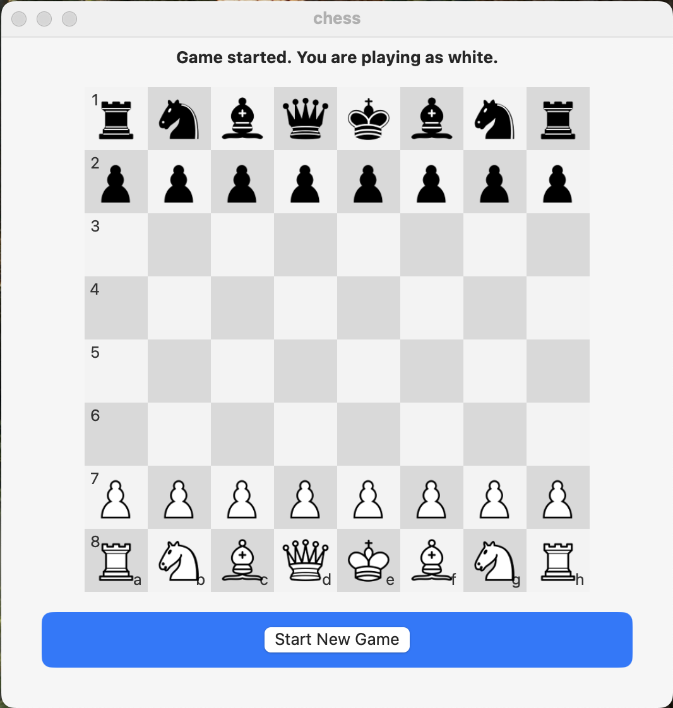
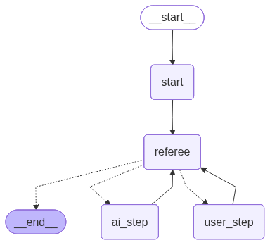
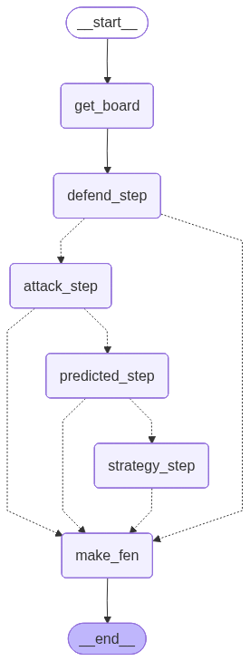
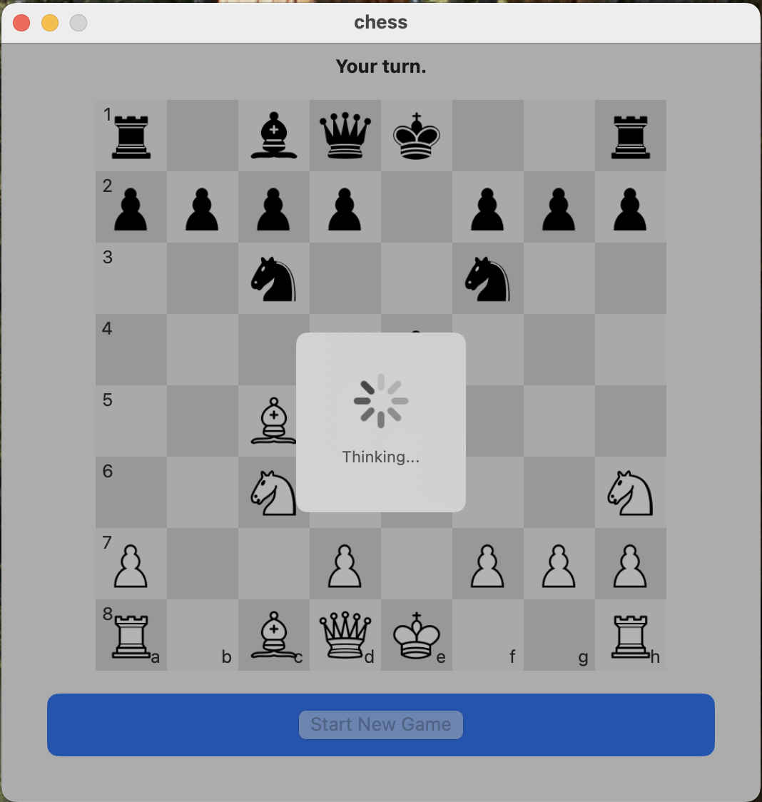
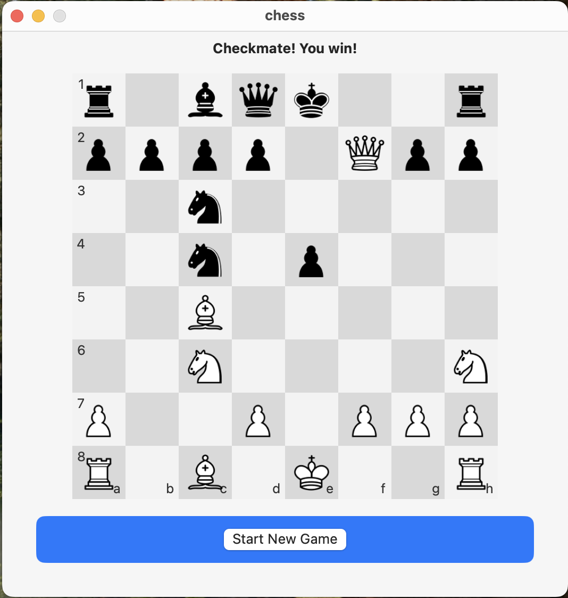
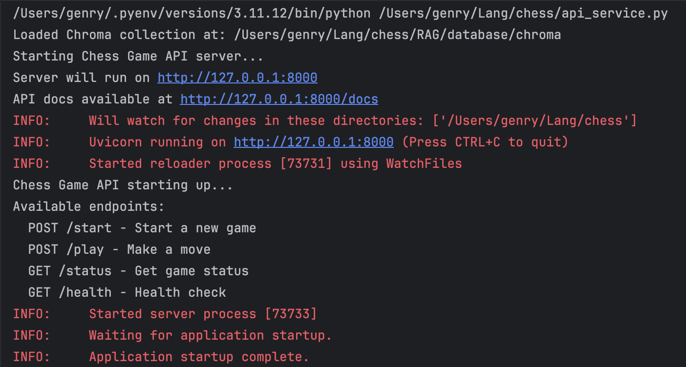

# Chess Game with AI - Advanced 3-Tier Architecture

An intelligent chess application featuring a sophisticated AI opponent built with LangGraph, FastAPI backend, and SwiftUI macOS frontend. The AI leverages a RAG (Retrieval-Augmented Generation) system trained on games from chess grandmasters Anatoly Karpov, Garry Kasparov, and Magnus Carlsen.



## 🏗️ Architecture Overview

This project implements a **3-tier architecture** with clear separation of concerns:

1. **🧠 AI Core (LangGraph)** - Intelligent chess engine with multi-agent decision making
2. **🔗 API Layer (FastAPI)** - RESTful service bridging frontend and AI backend  
3. **🖥️ Frontend (SwiftUI)** - Native macOS application with interactive chessboard

### Main Graph (LangGraph)


### Sub Graph (node `ai_step`)


## ✨ Key Features

### 🤖 Advanced AI System
- **Multi-Agent Architecture**: AI agents for defense, attack, prediction, and strategy
- **RAG-Enhanced Moves**: Leverages knowledge base of 3 chess grandmasters
- **LangGraph Workflow**: Complex decision trees with conditional routing
- **Tool-Assisted Validation**: Real-time move legality checking
- **Intelligent Fallbacks**: Multiple strategies when primary approach fails

### 🎯 Smart Chess Engine
- **4-Stage Decision Process**:
  1. **Defend** - Protect pieces under attack
  2. **Attack** - Capture opponent pieces safely  
  3. **Predict** - Use grandmaster game patterns
  4. **Strategy** - Apply chess principles and tactics
- **Priority-Based Logic**: King safety > material advantage > positional play
- **Dynamic Board Analysis**: Real-time piece relationship evaluation

### 🎮 User Experience
- **Intuitive Color Selection**: Choose White (first move) or Black
- **Visual Feedback**: Loading indicators during AI thinking
- **Game State Management**: Checkmate, draw, and resignation detection
- **Drag & Drop Interface**: Powered by [ChessboardKit](https://github.com/rohanrhu/ChessboardKit.git)

  

## 🚀 Quick Start

### Prerequisites
- **Python 3.11+** 
- **Xcode 15+** (for macOS app)
- **OpenAI API Key** (or alternative LLM provider)

### 1. Backend Setup

1. **Clone and install dependencies:**
   ```bash
   git clone https://github.com/genry86/Chess-Game-with-AI.git
   cd Chess-Game-with-AI
   pip install -r requirements.txt
   ```

2. **⚠️ CRITICAL: Configure your LLM provider**

   Create a `.env` file in the project root:
   ```bash
   # OpenAI (recommended)
   OPENAI_API_KEY=your-openai-api-key-here
   
   # Alternative: You can modify game_graph.py to use other providers:
   # - Claude (Anthropic)
   # - Gemini (Google)  
   # - Grok (xAI)
   # - Local models via Ollama
   ```

3. **⚠️ CRITICAL: Generate local RAG database for ai:**
   ```bash
   cd RAG
   python parse_multiple_pgns.py
   cd ../
   ```

4. **Start the API service:**
   ```bash
   python api_service.py
   ```
   
   
   
   The server runs on `http://127.0.0.1:8000` with endpoints:
   - `POST /start` - Initialize new game
   - `POST /play` - Process moves
   - `GET /status` - Game status  
   - `GET /health` - Health check

### 2. Frontend Setup

1. **Open Xcode project:**
   ```bash
   open swift/chess/chess.xcodeproj
   ```

2. **Build and run** the macOS app
   - App automatically connects to local API server
   - Select your color and start playing!

## 🧩 Project Structure

```
Chess-Game-with-AI/
├── 🐍 Python Backend
│   ├── game_graph.py          # LangGraph chess engine core
│   ├── api_service.py         # FastAPI REST endpoints
│   ├── utility.py             # Chess utilities & RAG system
│   ├── tools.py               # AI agent tools
│   ├── states.py              # TypedDict state definitions
│   ├── constants.py           # Configuration constants
│   └── prompts/               # AI agent system prompts
│       ├── agent_attack_prompt.txt
│       ├── agent_defend_prompt.txt  
│       ├── agent_predicted_steps_prompt.txt
│       ├── agent_strategy_step_prompt.txt
│       ├── agent_user_prompt.txt
│       └── chess_rules_description.txt
├── 🧠 RAG Knowledge Base
│   ├── data/                  # PGN files from grandmasters
│   │   ├── Carlsen.pgn        # Magnus Carlsen games
│   │   ├── Kasparov.pgn       # Garry Kasparov games  
│   │   └── Karpov.pgn         # Anatoly Karpov games
│   ├── database/chroma/       # ChromaDB vector database
│   ├── parse_single_pgn.py    # PGN parser for single files
│   ├── parse_multiple_pgns.py # Batch PGN processing
│   ├── test_rag.py            # RAG system testing
│   └── 3_best_players.txt     # Grandmaster information
├── 🍎 SwiftUI macOS App
│   └── swift/chess/
│       ├── Models/            # API data models
│       ├── Managers/          # APIManager for backend communication
│       ├── Scenes/Chess/      # Main game view & view model
│       ├── Components/        # Reusable UI components
│       └── Constants/         # App configuration
└── 📸 Documentation
    └── images/                # Screenshots and diagrams
```

## 🎯 Game Flow & AI Decision Making

### Main Graph Workflow
1. **🟢 Start** - Initialize game state with color selection
2. **⚖️ Referee** - Check for mate/draw/stalemate, manage game history
3. **👤 User Step** - Handle player moves via interrupt mechanism
4. **🤖 AI Step** - Execute AI subgraph for opponent move
5. **🔄 Loop** - Continue until game conclusion

### AI Subgraph (Opponent Decision Making)
1. **📊 Get Board** - Parse FEN into detailed piece analysis
2. **🛡️ Defend Step** - Protect pieces under attack (highest priority)
3. **⚔️ Attack Step** - Capture opponent pieces safely
4. **🔮 Predicted Step** - Query RAG system for grandmaster moves
5. **♟️ Strategy Step** - Apply chess principles and tactics  
6. **✅ Make FEN** - Generate new board position

### RAG System Intelligence
- **Vector Search**: Find similar positions from grandmaster games
- **Winner Filtering**: Prioritize moves from games won by AI's color
- **Score Ranking**: Weight moves by frequency of successful use
- **Legal Validation**: Verify all suggested moves before execution

## 🔧 Technical Implementation

### LangGraph Features Used
- **StateGraph**: Stateful workflow management
- **Conditional Edges**: Dynamic routing based on game state
- **Commands**: Resume execution with user input
- **Interrupts**: Pause for user interaction
- **Checkpointers**: Memory persistence across moves
- **Tool Integration**: AI agents with chess validation tools

### AI Tools Available
- `check_step_is_legal(fen, step)` - Move validation
- `get_new_board_state(fen, step, opponent_color)` - Future position analysis

### State Management
```python
class GameState(TypedDict):
    user_color: str      # 'white' or 'black'
    ai_color: str        # 'white' or 'black'  
    turn: str           # 'user' or 'ai'
    status: str         # 'playing', 'mate', 'draw', 'resignation'
    fen: str            # Current board position
    history_fens: List[str]  # Move history
    ai_state: AIState   # AI decision-making state
```

## 🎮 Gameplay Features

### Chess Rules Implementation
- **Complete Rule Set**: All standard chess rules including castling, en passant, promotion
- **Illegal Move Prevention**: Real-time validation prevents invalid moves
- **Game End Detection**: Automatic checkmate, stalemate, and draw recognition
- **Piece Priorities**: King > Queen > Rook/Knight/Bishop > Pawn

### UI/UX Features  
- **Modern SwiftUI Interface**: Native macOS design patterns
- **Responsive Chessboard**: Smooth drag & drop interactions
- **Game Status Display**: Clear feedback on game state
- **Loading Indicators**: Visual feedback during AI thinking
- **Error Handling**: Graceful handling of network/API issues

## 🔌 Alternative LLM Configuration

To use different LLM providers, modify `game_graph.py` line 54:

```python
# Current (OpenAI)
llm = ChatOpenAI(model="gpt-4.1", temperature=AIConstants.TEMPERATURE)

# Alternative configurations:
# Claude
# llm = ChatAnthropic(model="claude-3-sonnet-20240229") 

# Gemini  
# llm = ChatGoogleGenerativeAI(model="gemini-pro")

# Local Ollama
# llm = ChatOllama(model="llama2:7b")
```

## 🧪 Testing & Development

### RAG System Testing
```bash
cd RAG/
python test_rag.py  # Test vector database queries
python parse_multiple_pgns.py  # Rebuild database if needed
```

### API Testing
```bash
# Health check
curl http://127.0.0.1:8000/health

# Start game
curl -X POST http://127.0.0.1:8000/start \
  -H "Content-Type: application/json" \
  -d '{"user_color": "white"}'
```

## 🛠️ Development Notes

### Code Architecture
- **Clean Separation**: Each tier has distinct responsibilities
- **Type Safety**: Comprehensive TypedDict definitions
- **Error Resilience**: Graceful fallbacks and retry mechanisms
- **Modular Design**: Easy to extend with new AI strategies

### Performance Optimizations
- **Vector Database**: Fast similarity search for position analysis
- **Move Caching**: Avoid recalculating legal moves
- **Efficient FEN Parsing**: Optimized board state representation
- **Async API**: Non-blocking request handling

## 📄 API Documentation

The FastAPI service provides automatic API documentation at `http://127.0.0.1:8000/docs` when running.

### Core Endpoints

**POST /start**
```json
{
  "user_color": "white" // or "black"
}
```

**POST /play** 
```json
{
  "fen": "rnbqkbnr/pppppppp/8/8/8/5N2/PPPPPPPP/RNBQKB1R b KQkq - 1 1"
}
```

**Response Format**
```json
{
  "fen": "current_board_position",
  "status": "playing", // or "mate", "draw"  
  "turn": "user", // or "ai"
  "message": "Your turn." // or game result
}
```

## 📜 License

All rights reserved. See [LICENSE](LICENSE) for details.

## 🙏 Acknowledgments

- **Chess Grandmasters**: Games from Magnus Carlsen, Garry Kasparov, and Anatoly Karpov
- **ChessboardKit**: Excellent SwiftUI chess component by [@rohanrhu](https://github.com/rohanrhu/ChessboardKit)
- **LangGraph**: Powerful workflow framework by LangChain
- **python-chess**: Comprehensive chess library
- **ChromaDB**: Vector database for RAG implementation

---

**Ready to play chess against an AI trained on grandmaster games? Get started now!** 🏆